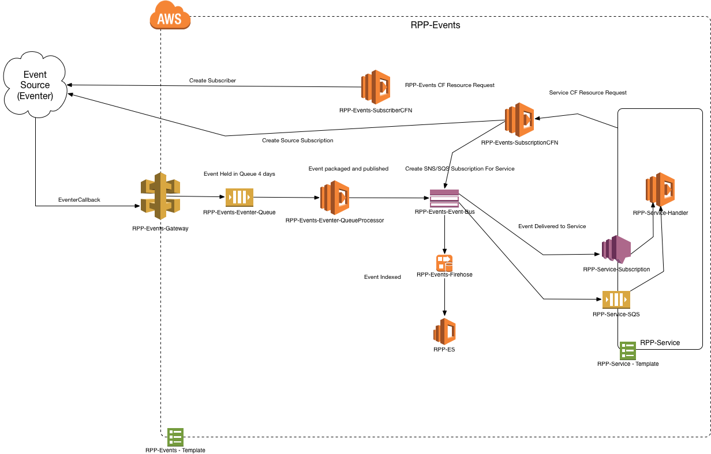

| Development                                                                                                                                                                                                                                                                                                                              | UAT                                                                                                                                                                                                                                                                                                                      | Release                                                                                                                                                                                                                                                                                                                          | Production                                                                                                                                                                                                                                                                                                                             |
| ---------------------------------------------------------------------------------------------------------------------------------------------------------------------------------------------------------------------------------------------------------------------------------------------------------------------------------------- | ------------------------------------------------------------------------------------------------------------------------------------------------------------------------------------------------------------------------------------------------------------------------------------------------------------------------ | -------------------------------------------------------------------------------------------------------------------------------------------------------------------------------------------------------------------------------------------------------------------------------------------------------------------------------- | -------------------------------------------------------------------------------------------------------------------------------------------------------------------------------------------------------------------------------------------------------------------------------------------------------------------------------------- |
|  |  |  |  |

# RPP-EVENTS



This project bridges event sources outside of RPP into RPP services. Interaction with rpp-events is done through a cloudformation custom resource.


## Getting Started

### Development

#### Clone the repo:

```
$ git clone --recurse-submodules git@ghe.coxautoinc.com:ReconMVS/rpp-events.git
```

Or if you didn't use the `--recurse-submodules` - after cloning the repo:

```
$ git submodule init

$ git submodule update
```

#### Source Code

Source code is located the `src/rpp_events` and further broken up by:

1. `cfn` - cloudformation custom resource lambda functions
2. `eventer` - lambda function for processing eventer sourced events

#### CI/CD

Integration and deployment are managed through the following files::

1. `template.yml` - this is a SAM CF serverless template. All resources are defined in this file
2. `build.sh` - this is a bash script used by codebuild in order to deploy `rpp-events`
3. `run.sh` - utility script for running codebuild locally or building a local copy of lambda functions
4. `codebuild-*` - these files are used to set up the codebuild project
5. `env.sh` - this file is sourced by `build.sh` in order to set environment variables during build and deployment of `rpp-events`

### Integrating with `rpp-events`

#### Custom Resource

****Custom:: (Some_Custom_Name)****

The rpp-events resource creates a new subscription to an event source managed by rpp-events .

**Syntax**

```yaml
  RPPEventSubscription:
    Type: Custom:: (string)
    Properties:
      ServiceToken: (Arn)
      Source:
        Eventer:
          Events:
          - (string)
          - (string)
          - (string)
      Targets:
        SQS: (Arn)
        Lambda: (Arn)
```

#### Properties

**ServiceToken**
the service token of the rpp-events custome resource function. This should be prefixed with the environment you intend to make the subscription within.

_Required_: Yes

_Type_: Arn

_Update requires_: Replacement

**Source**
This section will define where the events are sources, currently this is only `Eventer`

_Required_: Yes

_Type_: currently must be `Eventer`

_Update requires_: Replacement

**Events**
list of events in which to subscribe. Same syntax as the source, in thise case `Eventer`

_Required_: Yes

_Type_: list

_Update requires_: Replacement

**Targets**
targets for which to fan out the sourced events

_Required_: Yes

_Type_: either `SQS` or `Lambda` or Both

_Update requires_: possibly, if SQS or Lambda existed before but not present, will be deleted

**SQS**
SQS queue to send received events

_Required_: Must provide either SQS or Lambda

_Type_: Arn

_Update requires_: new arn, new queue

**Lambda**
Lambda function to trigger with events

_Required_: Must provide either SQS or Lambda

_Type_: Arn

_Update requires_: new arn, new queue

#### Return Value

**Fn::GetAtt**
Fn::GetAtt returns a value for a specified attribute of this type. The following are the available attributes and sample return values.

_SQSSubscriptionArn_
Returns the `Arn` of the SQS subscription made for this subscription.

_LambdaSubscriptionArn_
Returns the `Arn` of the Lambda subscription made for this subscription.

_TopicArn_
Returns the `Arn` of the `rpp-events` SNS topic used as an event bus.

_StreamName_
Returns the `Arn` of the `rpp-events` Kinesis stream used.

For more information about using Fn::GetAtt, see Fn::GetAtt.

#### Examples

The following example SAM template deploys a sample lambda function and queue to process a set of events from `rpp-events`. It uses an input parameter as a means to pull the correct service token for the `rpp-events` service token. That token should correspond to the environment you are deploying your service into. If you use a parameter like the example then you mus provide the `ec2 parameter store` key as input to the CF template. For example:

```shell
aws cloudformation deploy --template-file rpp-events-cf-cfntest.cf.yml --stack-name US105150-rpp-events-test-cfn --capabilities CAPABILITY_NAMED_IAM --parameter-overrides EnvironmentName=US105150 CFNServiceToken=/ReconMVS/rpp-events/US105150/cfn/subscription/ServiceToken
```

Another option is detailed here:  however, you can't use `!Sub` and must use the **Exact** key.

```yaml
AWSTemplateFormatVersion: "2010-09-09"
Transform: AWS::Serverless-2016-10-31

Description: |
  Functions and resources to test rpp-events cfn custom resource

Parameters:
  EnvironmentName:
    Description: The name of the environment to which rpp-events should be deployed
    Type: String
    Default: reconmvslocal

  CFNServiceToken:
    Description: the service token of the custom resource to be used in creating an rpp-events subscription
    Type: "AWS::SSM::Parameter::Value<String>"
    Default: /ReconMVS/rpp-events/development/cfn/subscription/ServiceToken

Resources:
  RPPEventsCFNTestRole:
    Type: AWS::IAM::Role
    Properties:
      RoleName: !Sub ${EnvironmentName}-rpp-events-cfn-test-role
      AssumeRolePolicyDocument:
        Version: "2012-10-17"
        Statement:
          - Effect: Allow
            Principal:
              Service:
                - lambda.amazonaws.com
            Action:
              - sts:AssumeRole

  RPPEventsCFNTestPolicy:
    Type: AWS::IAM::Policy
    Properties:
      PolicyName: !Sub ${EnvironmentName}-rpp-events-cfn-policy
      Roles:
        - !Ref RPPEventsCFNTestRole
      PolicyDocument:
        Version: "2012-10-17"
        Statement:
          - Effect: Allow
            Action:
              - logs:CreateLogGroup
            Resource:
              - !Sub "arn:aws:logs:${AWS::Region}:${AWS::AccountId}:log-group:*"
          - Effect: Allow
            Action:
              - logs:CreateLogStream
              - logs:PutLogEvents
            Resource:
              - !Sub "arn:aws:logs:${AWS::Region}:${AWS::AccountId}:log-group:/aws/lambda/*"

  RPPEventsTestQueue:
    Type: AWS::SQS::Queue
    Properties:
      QueueName: !Sub ${EnvironmentName}-rpp-events-cfn-test-sqs

  RPPEventsTestQueuePolicy:
    Type: AWS::SQS::QueuePolicy
    Properties:
      Queues:
        - !Ref RPPEventsTestQueue
      PolicyDocument:
        Version: "2012-10-17"
        Id: "RPPEventsTestQueuePolicy"
        Statement:
          - Effect: Allow
            Principal:
              AWS: "*"
            Action:
              - sqs:SendMessage
              - sqs:ReceiveMessage
            Resource:
              - !GetAtt RPPEventsTestQueue.Arn
            Condition:
              ArnEquals:
                aws:SourceArn:
                  - !GetAtt RPPEventSubscription.TopicArn

  RPPEventSubscription:
    Type: Custom::RPPEventsSubscription
    Properties:
      ServiceToken: !Ref CFNServiceToken
      Source:
        Eventer:
          Events:
            - "ORDERS.APPROVAL.COMPLETED"
            - "ORDERS.CAPTURE.UPDATED"
            - "ORDERS.CERTIFICATION.CREATED"
      Targets:
        SQS: !GetAtt RPPEventsTestQueue.Arn
        Lambda: !GetAtt RPPEventsTestCFN.Arn

  RPPEventsTestCFN:
    Type: AWS::Serverless::Function
    Properties:
      Runtime: python3.9
      CodeUri: ./build
      Handler: rpp_events.cfn.cfn_echo_test.handler
      FunctionName: !Sub ${EnvironmentName}-rpp-events-cfn-test
      Timeout: 300
      Role: !GetAtt RPPEventsCFNTestRole.Arn
      Events:
        RPPEvents:
          Type: SNS
          Properties:
            Topic: !GetAtt RPPEventSubscription.TopicArn

Outputs:
  LambdaSubscriptionArn:
    Description: the sub arn
    Value: !GetAtt RPPEventSubscription.LambdaSubscriptionArn

  SQSSubscriptionArn:
    Description: the sub arn
    Value: !GetAtt RPPEventSubscription.SQSSubscriptionArn

  TopicArn:
    Description: the topic arn
    Value: !GetAtt RPPEventSubscription.TopicArn

  StreamName:
    Description: the stream name
    Value: !GetAtt RPPEventSubscription.StreamName
```
